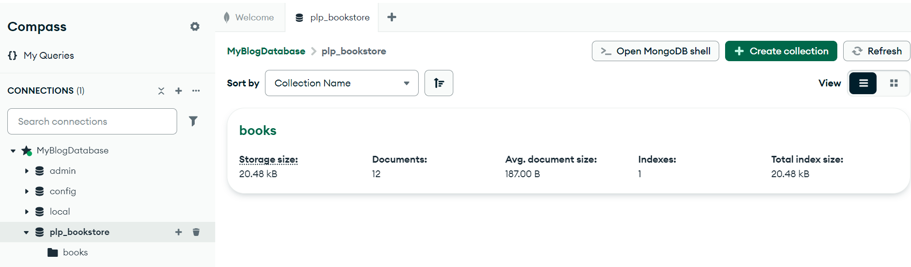
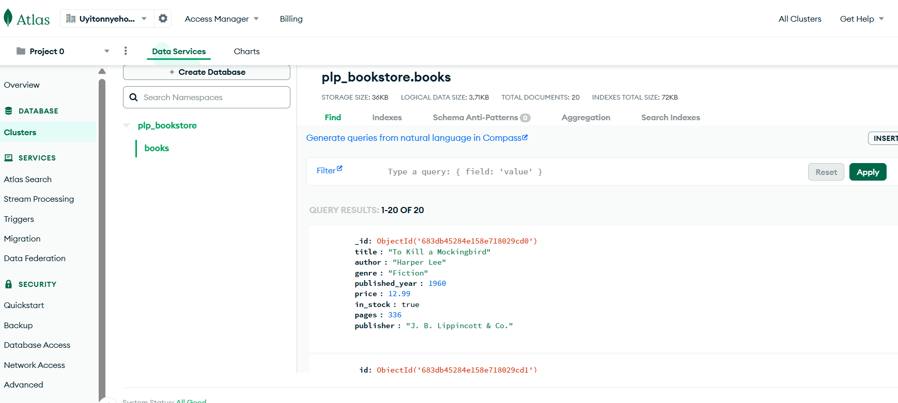
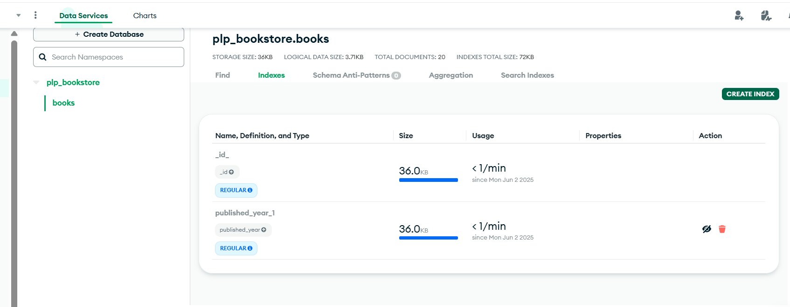
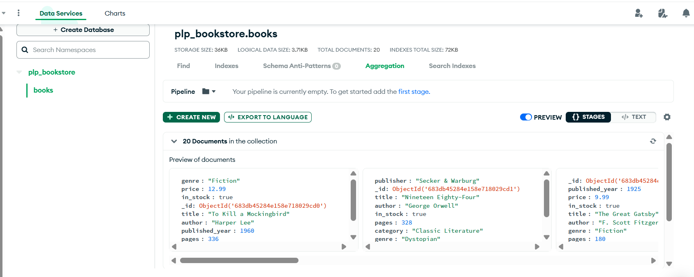
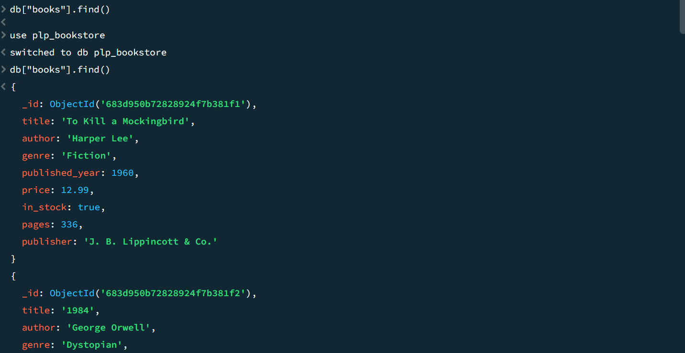

# MongoDB Fundamentals Assignment

This assignment focuses on learning MongoDB fundamentals including setup, CRUD operations, advanced queries, aggregation pipelines, and indexing.

## Assignment Overview

You will:
1. Set up a MongoDB database
2. Perform basic CRUD operations
3. Write advanced queries with filtering, projection, and sorting
4. Create aggregation pipelines for data analysis
5. Implement indexing for performance optimization

## Getting Started

1. Accept the GitHub Classroom assignment invitation
2. Clone your personal repository that was created by GitHub Classroom
3. Install MongoDB locally or set up a MongoDB Atlas account
4. Run the provided `insert_books.js` script to populate your database
5. Complete the tasks in the assignment document

## Files Included

- `Week1-Assignment.md`: Detailed assignment instructions
- `insert_books.js`: Script to populate your MongoDB database with sample book data

## Requirements

- Node.js (v18 or higher)
- MongoDB (local installation or Atlas account)
- MongoDB Shell (mongosh) or MongoDB Compass

## Submission

Your work will be automatically submitted when you push to your GitHub Classroom repository. Make sure to:

1. Complete all tasks in the assignment
2. Add your `queries.js` file with all required MongoDB queries
3. Include a screenshot of your MongoDB database
4. Update the README.md with your specific setup instructions

## Resources

- [MongoDB Documentation](https://docs.mongodb.com/)
- [MongoDB University](https://university.mongodb.com/)
- [MongoDB Node.js Driver](https://mongodb.github.io/node-mongodb-native/) 

## ----------------------- Correction -----------------------------------

# MongoDB Fundamentals – Week 1 Assignment

## 🛠️ Setup Instructions

- **MongoDB Atlas** account created
- **Database Name:** `plp_bookstore`
- **Collection Name:** `books`
- **User:** `plp_user` with `readWrite` access
- **Documents Inserted:** via `insert_books.js`

## 🔧 Technologies Used

- MongoDB Atlas (cloud database)
- MongoDB Compass (GUI)
- MongoDB Shell (`mongosh`)
- Node.js (v18+)

## 📂 Files Included

| File Name         | Description                                 |
|------------------|---------------------------------------------|
| `insert_books.js` | Script to insert initial book data         |
| `queries.js`      | All MongoDB queries (CRUD, filter, sort, etc.) |
| `README.md`       | Setup and documentation                    |

## 📋 Tasks Completed

### ✅ 1. MongoDB Atlas Setup
- ✔️ Created MongoDB Atlas cluster
- ✔️ Created database: `plp_bookstore`
- ✔️ Created collection: `books`
- ✔️ Created user: `plp_user` with appropriate privileges

### ✅ 2. Insert Books
- Inserted 12 sample book documents using `insert_books.js`

### ✅ 3. CRUD Operations in `queries.js`
- Create: `insertOne()`, `insertMany()`
- Read: `find()`, `findOne()`
- Update: `updateOne()`, `updateMany()`
- Delete: `deleteOne()`, `deleteMany()`

### ✅ 4. Advanced Queries
- Filtering by author and year
- Projection to return specific fields
- Sorting by rating

### ✅ 5. Aggregation Pipelines
- Used `$group` to find average rating
- Used `$match` and `$project` for conditional queries

### ✅ 6. Indexing
- Created indexes on `title`, `author`
- Verified indexes using `.indexes()` and Compass

## 🖼️ Screenshots

Include the following:
- 📸 Compass showing `plp_bookstore.books` collection
- 📸 Output from running `queries.js`
- 📸 Index tab from Compass or `db.books.getIndexes()` output

## 📦 How to Run

# Install dependencies
npm install

# Run your query script
node queries.js

## ouutputs 

